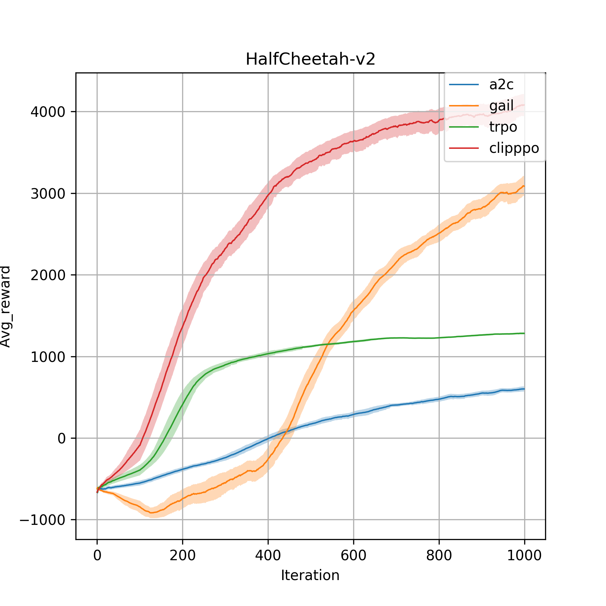
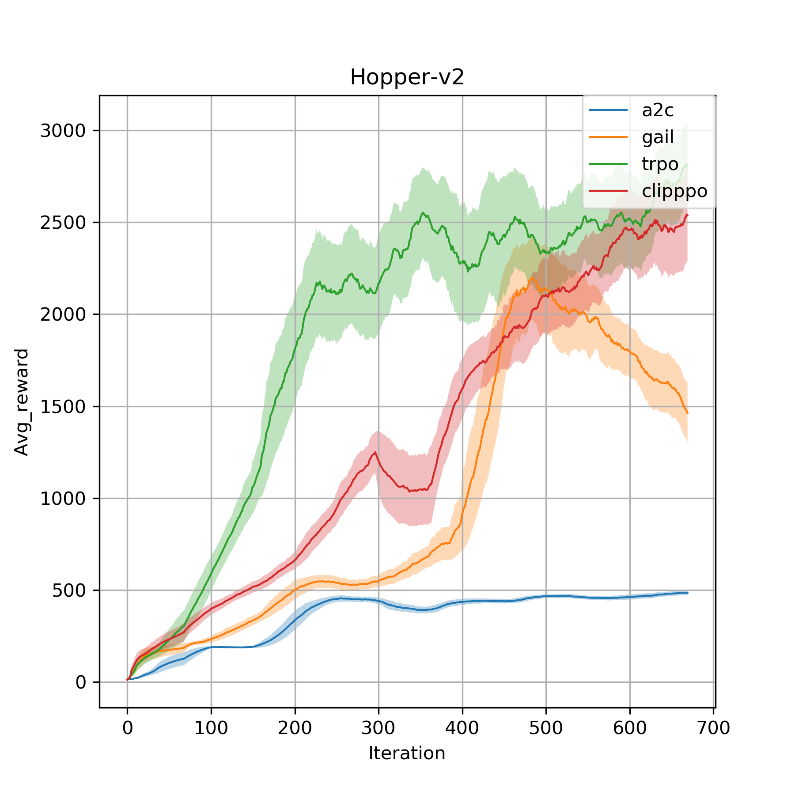
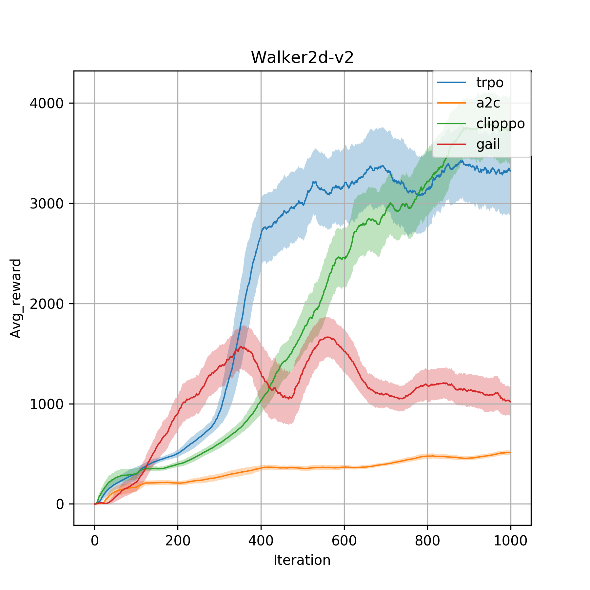

# PyTorch implementation of reinforcement learning algorithms
Based on https://github.com/Khrylx/PyTorch-RL and some modification made.

## Important notes
- To run mujoco environments, first install [mujoco-py](https://github.com/openai/mujoco-py) and suggested [modified version of gym](https://github.com/Khrylx/gym) which supports mujoco 1.50.
- If you have a GPU, I recommend setting the OMP_NUM_THREADS to 1 (PyTorch will create additional threads when performing computations which can damage the performance of multiprocessing. This problem is most serious with Linux, where multiprocessing can be even slower than a single thread):
```
export OMP_NUM_THREADS=1
```
- Code structure: [Agent](https://github.com/lx10077/rlpy/blob/master/core/agent.py) collects samples;
[Trainer](https://github.com/lx10077/rlpy/blob/master/core/trainer.py) facilitates learning and training;
[Evaluator](https://github.com/lx10077/rlpy/blob/master/core/evaluator.py) tests trained models in new environments.
- After training several agents on one environment, you can plot the training process in one figure by
```
python utils/plot.py --env-name <ENVIRONMENT_NAME> --x_len 1000 --save_data
```

## Policy Gradient Methods
* [Trust Region Policy Optimization (TRPO)](https://arxiv.org/pdf/1502.05477.pdf) -> [examples/trpo_gym.py](https://github.com/lx10077/rlpy/blob/master/examples/trpo_gym.py)
* [Proximal Policy Optimization (PPO)](https://arxiv.org/pdf/1707.06347.pdf) -> [examples/ppo_gym.py](https://github.com/lx10077/rlpy/blob/master/examples/ppo_gym.py)
* [Synchronous A3C (A2C)](https://arxiv.org/pdf/1602.01783.pdf) -> [examples/a2c_gym.py](https://github.com/lx10077/rlpy/blob/master/examples/a2c_gym.py)

### Example
```
python examples/ppo_gym.py --env-name Hopper-v2 --max-iter-num 1000 --save-model-interval 50 --eval-model-interval 10
```

### Reference
* [Khrylx/PyTorch-RL](https://github.com/Khrylx/PyTorch-RL)
* [ikostrikov/pytorch-trpo](https://github.com/ikostrikov/pytorch-trpo)
* [openai/baselines](https://github.com/openai/baselines)

## Generative Adversarial Imitation Learning
* [GAIL](https://arxiv.org/abs/1606.03476) -> [gail/gail_gym.py](https://github.com/lx10077/rlpy/blob/master/gail/gail_gym.py)
### To save trajectory
If you want to do GAIL but without existing expert trajectories, [TrajGiver](https://github.com/lx10077/rlpy/blob/master/gail/traj_giver.py)
will help us generate it. However, make sure the export policy has been generated and saved (i.e. train a TRPO or PPO agent
 on the same environment) such that TrajGiver would automatically first find the export directory, then load the policy
  network and running states, and eventually run the well-trained policy on desired environment.

### To do imitation learning
```
python gail/gail_gym.py --env-name Hopper-v2 --max-iter-num 1000 --save-model-interval 50 --eval-model-interval 10
```

## Results

<p align="middle">
    
    
    
</p>


