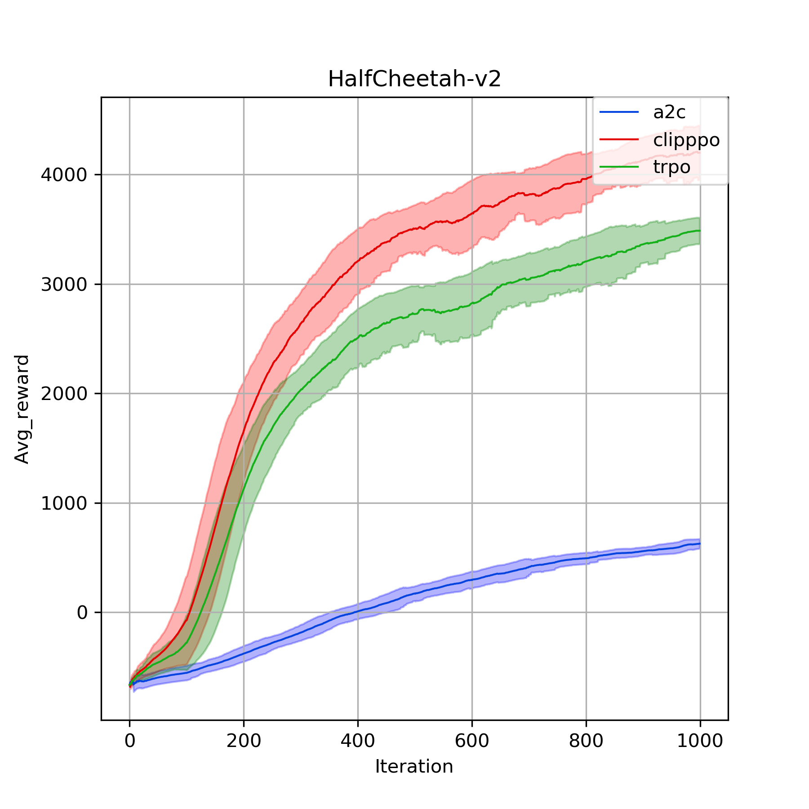
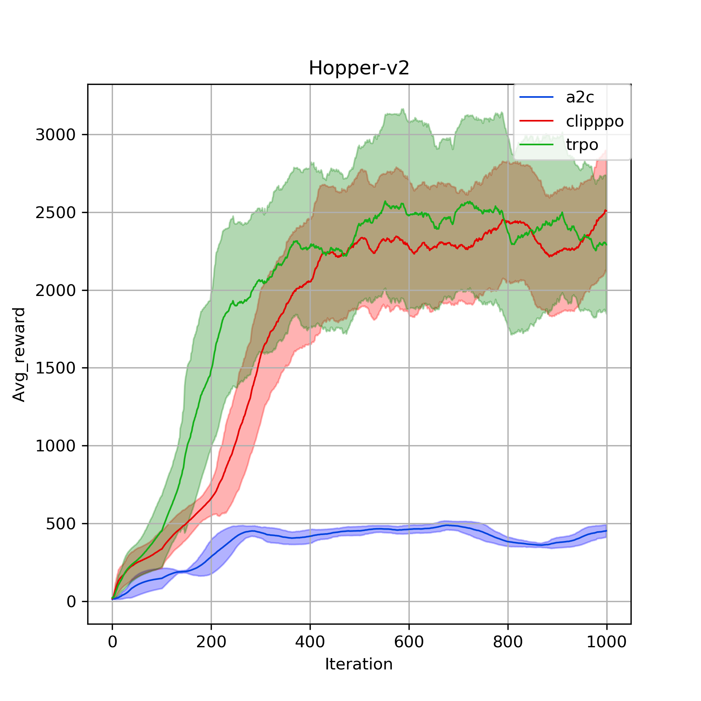
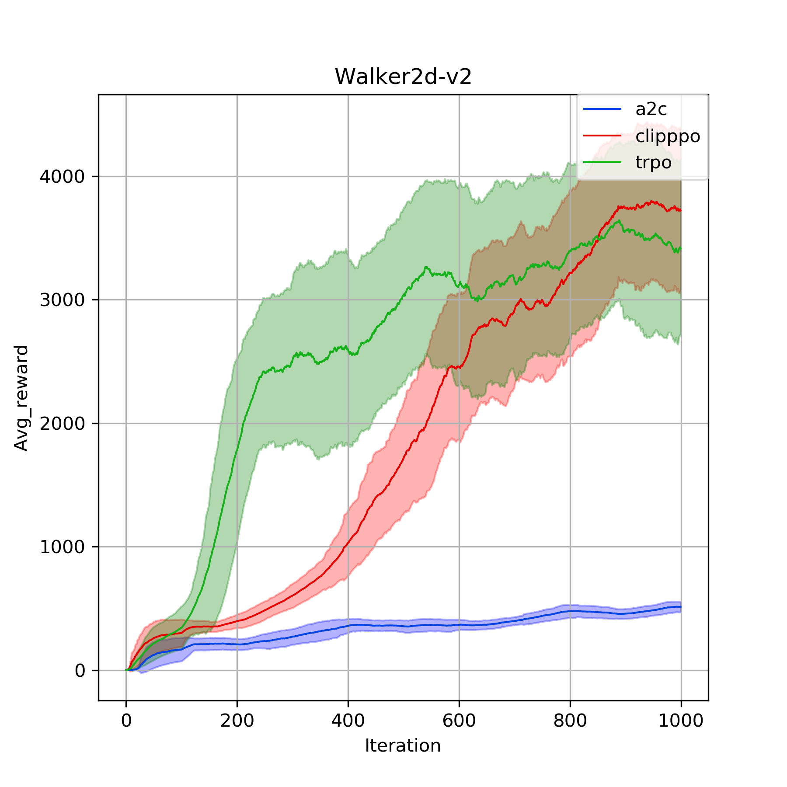
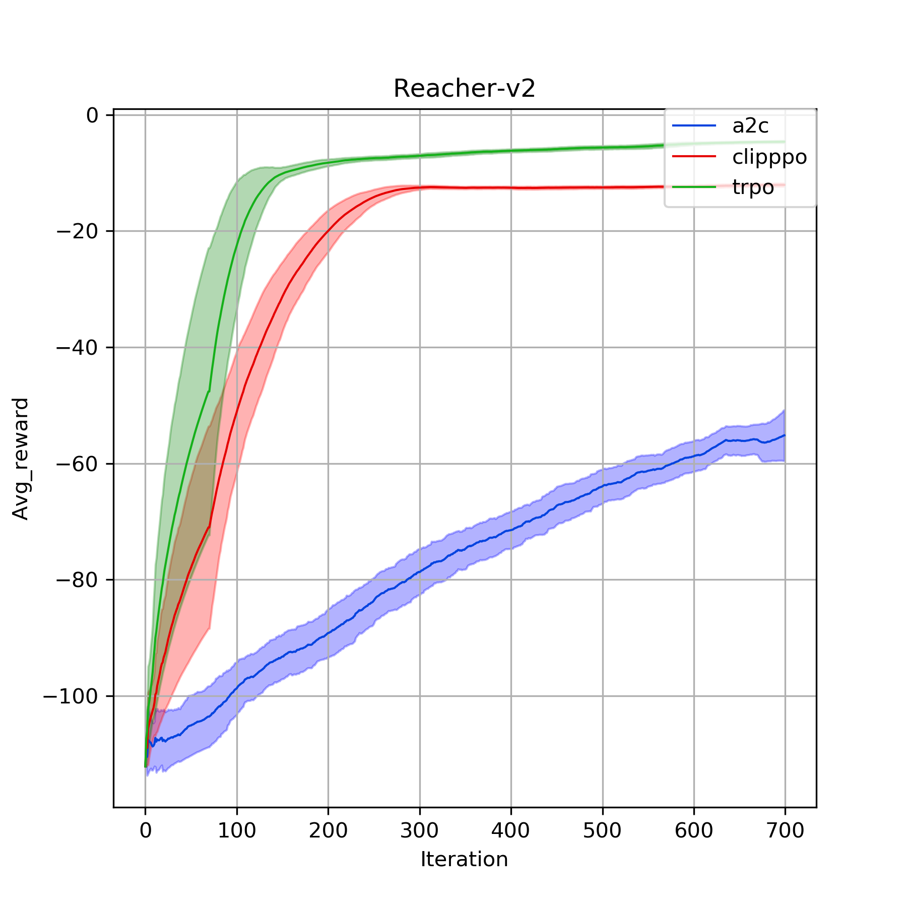
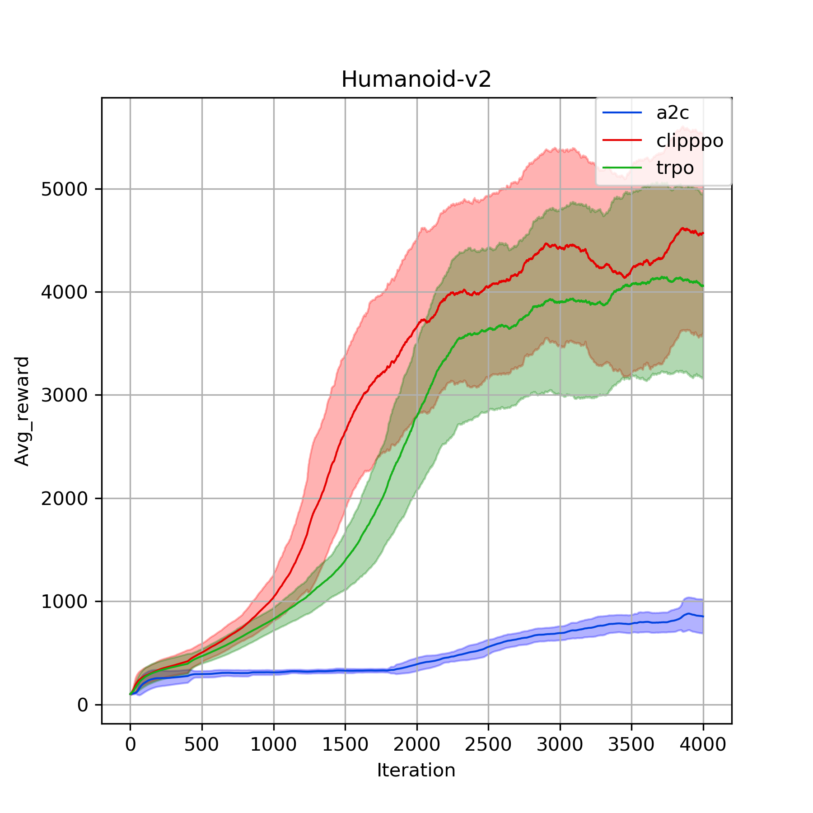
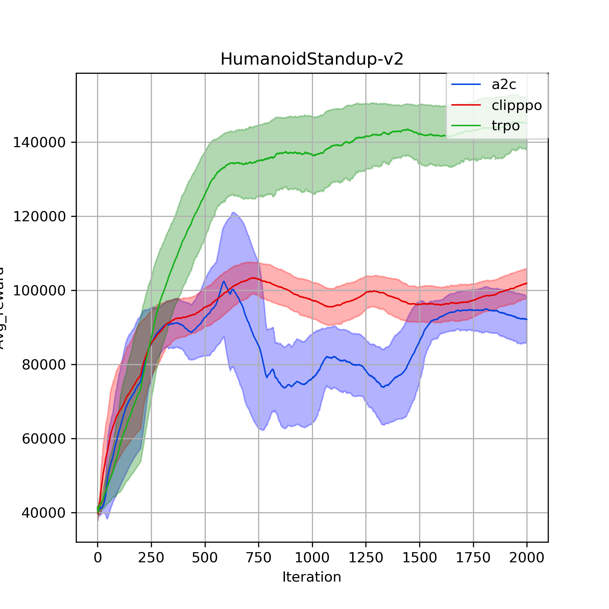
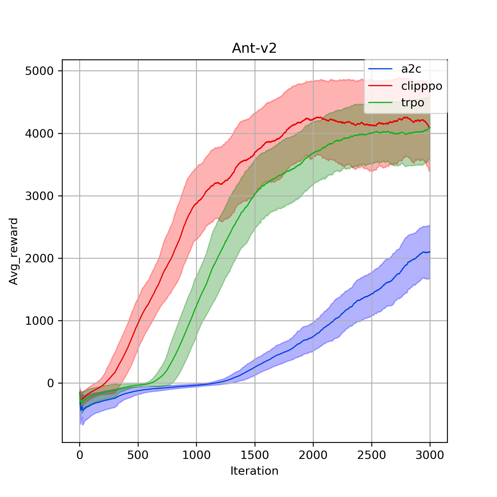
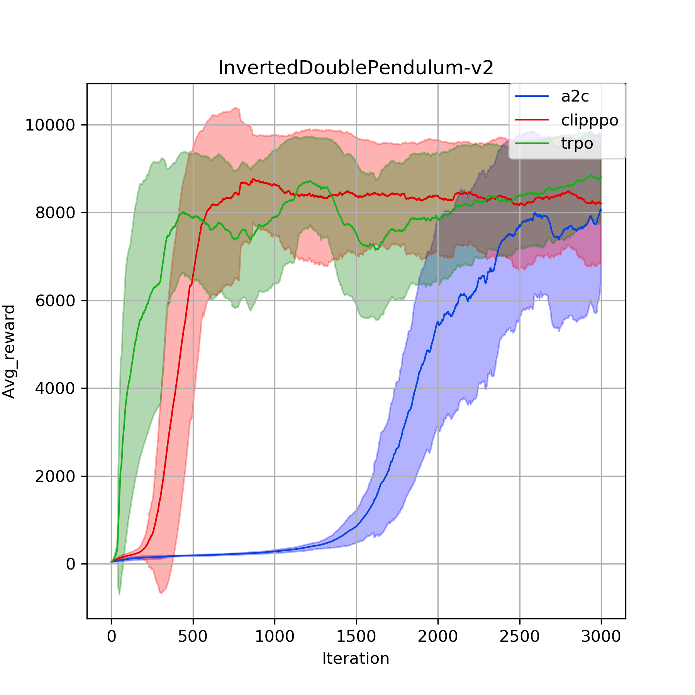
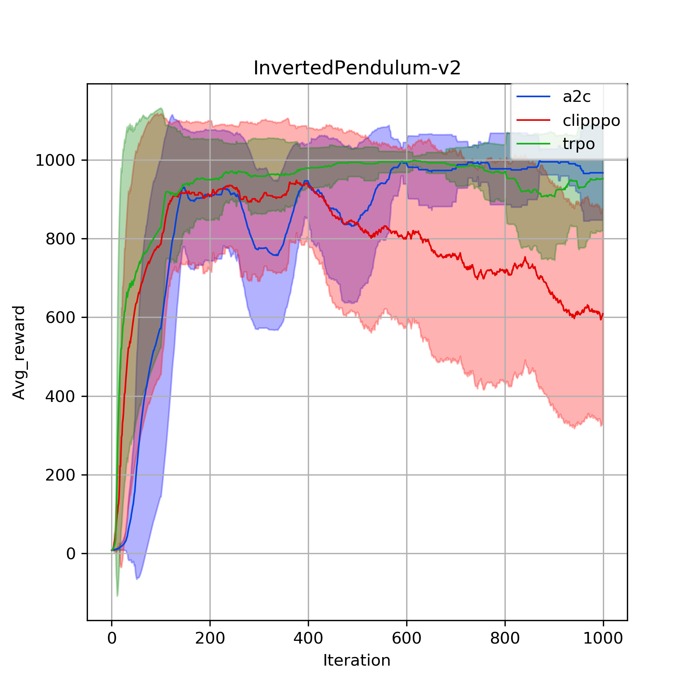
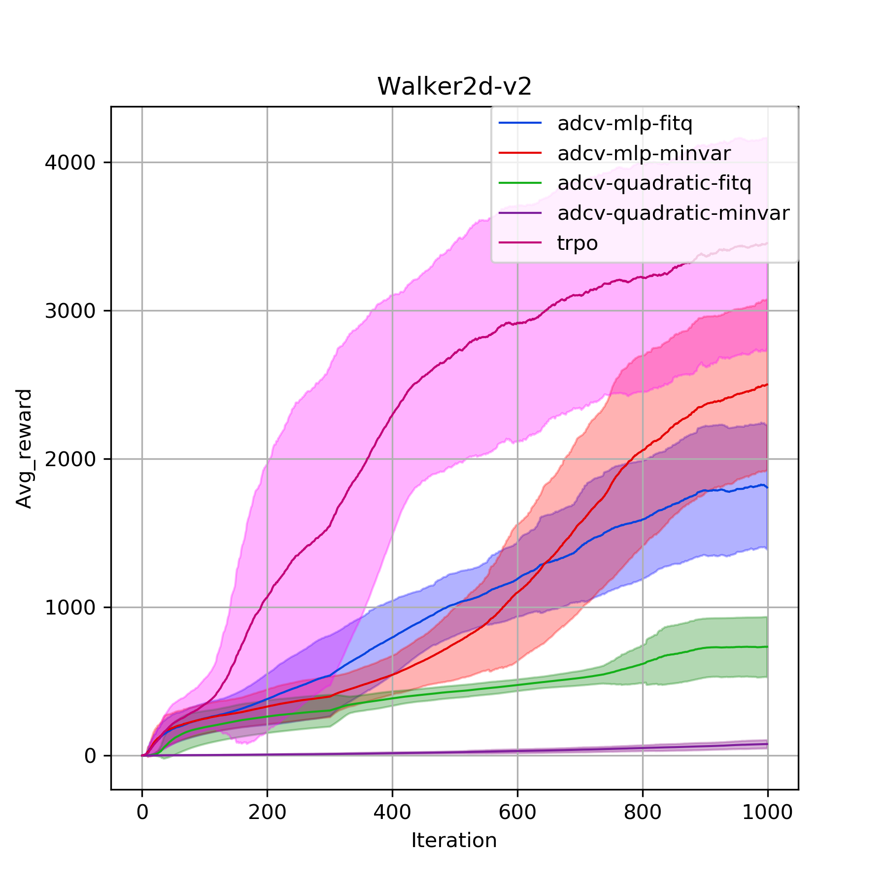

# PyTorch implementation of reinforcement learning algorithms

## Important notes
- To run mujoco environments, first install [mujoco-py](https://github.com/openai/mujoco-py) and suggested [modified version of gym](https://github.com/Khrylx/gym) which supports mujoco 1.50.
- Make sure the version of Pytorch is at least 0.4.0.
- If you have a GPU, you are recommended to set the OMP_NUM_THREADS to 1, since PyTorch will create additional threads when performing computations which can damage the performance of multiprocessing.
(This problem is most serious with Linux, where multiprocessing can be even slower than a single thread):
```
export OMP_NUM_THREADS=1
```
- Code structure: [Agent](https://github.com/lx10077/rlpy/blob/master/core/agent.py) collects samples;
[Trainer](https://github.com/lx10077/rlpy/blob/master/core/trainer.py) facilitates learning and training;
[Evaluator](https://github.com/lx10077/rlpy/blob/master/core/evaluator.py) tests trained models in new environments.
All examples are placed under `config` file.
- After training several agents on one environment, you can plot the training process in one figure by
```
python utils/plot.py --env-name <ENVIRONMENT_NAME> --x_len <ITERATION_NUM> --save_data
```

## Policy Gradient Methods
* [Trust Region Policy Optimization (TRPO)](https://arxiv.org/pdf/1502.05477.pdf) -> [config/pg/trpo_gym.py](https://github.com/lx10077/rlpy/blob/master/config/pg/trpo_gym.py)
* [Proximal Policy Optimization (PPO)](https://arxiv.org/pdf/1707.06347.pdf) -> [config/pg/ppo_gym.py](https://github.com/lx10077/rlpy/blob/master/config/pg/ppo_gym.py)
* [Synchronous A3C (A2C)](https://arxiv.org/pdf/1602.01783.pdf) -> [config/pg/a2c_gym.py](https://github.com/lx10077/rlpy/blob/master/config/pg/a2c_gym.py)

### Example
```
python config/pg/ppo_gym.py --env-name Hopper-v2 --max-iter-num 1000 --gpu
```

### Reference
* [Khrylx/PyTorch-RL](https://github.com/Khrylx/PyTorch-RL)
* [ikostrikov/pytorch-trpo](https://github.com/ikostrikov/pytorch-trpo)
* [openai/baselines](https://github.com/openai/baselines)

### Results
We test the policy gradient codes in these Mujoco environments with default parameters.
<p align="middle">
    
    
    
</p>
<p align="middle">
    
    
    
</p>

<p align="middle">
    
    
    
</p>


## Generative Adversarial Imitation Learning
* [GAIL](https://arxiv.org/abs/1606.03476) -> [conig/gail/gail_gym.py](https://github.com/lx10077/rlpy/blob/master/config/gail/gail_gym.py)
### To save trajectory
If you want to do GAIL but without existing expert trajectories, [TrajGiver](https://github.com/lx10077/rlpy/blob/master/config/gail/traj_giver.py)
will help us generate it. However, make sure the export policy has been generated and saved (i.e. train a TRPO or PPO agent
 on the same environment) such that TrajGiver would automatically first find the export directory, then load the policy
  network and running states, and eventually run the well-trained policy on desired environment.

### To do imitation learning
```
python config/gail/gail_gym.py --env-name Hopper-v2 --max-iter-num 1000  --gpu
```

## Action Dependent Control Variate
* [ADCV](http://arxiv.org/abs/1710.11198) -> [config/adcv/v_gym.py](https://github.com/lx10077/rlpy/blob/master/config/adcv/v_gym.py)
### Example
```
python config/adcv/v_gym.py --env-name Walker2d-v2 --max-iter-num 1000 --variate mlp --opt minvar --gpu
```
### Results

<p align="middle">
    
</p>